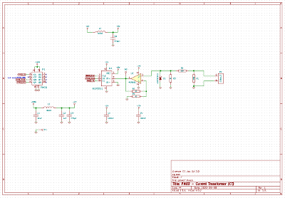

PMOD Current Transformer
========================

This PMOD allow to interface a current transformer (CT) for current measurement
with no direct electrical coupling. This PMOD use a type 2 (SPI) port to
control the embedded 12 bits analog to digital converter.

CAD source
----------

This board has been designed using KiCad EDA (version 5). All sources files
(schematics, routing, ...) are available into the `prj-kicad` folder. You can
re-use this design under terms of the Creative Commons ShareAlike license
(CC BY-SA)

<table>
<tr>
<td></td>
<td></td>
</tr>
<tr>
<td>Fig1: Preview of the KiCad schematics</td>
<td>Fig2: Preview of the KiCad routing</td>
</tr>
</table>

